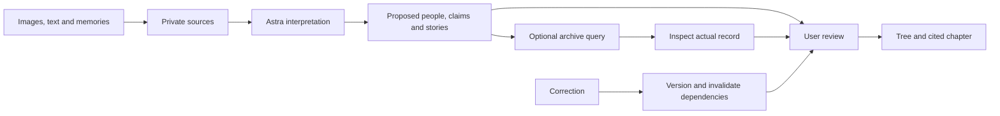

# Architecture and shared contract

Proposed initial implementation. Pin compatible package versions when scaffolding. Use one Next.js application with server route handlers; Postgres is enough for the graph. No general crawler or separate graph database is needed for the first slice.



## Data model

| Table | Minimum contract |
| --- | --- |
| projects | Owner, title, language, version, visibility |
| sources | Project, kind, original text/private file path, hash, source URI, record/revision ID, retrieved time, rights |
| persons | Stable ID, display name, aliases, accepted claim IDs |
| claims | Subject, predicate, value, evidence references, evidence kind, review status, version |
| stories | Original span, narrator, faithful summary, mentioned people, optional claims, publication preference, version |
| relationships | Endpoints, type, evidence claim IDs, proposed/accepted/rejected/needs-review, version |
| runs | Goal, stage, input/project version, candidates, artifacts, pending question, lease, budget, error |
| chapters | Sections, claim/story/source dependencies, versions, review status |
| changes | Actor, action, before/after references, timestamp |

Candidate objects may initially be validated JSONB inside runs; they need persistent IDs and explicit identity decisions. Source kinds include original record, transcription, memory, another tree and inference. Review status is independent of evidence kind.

Use one Zod contract under `src/contracts/` and infer TypeScript types from it. Proposed shared envelopes: GraphPatch, Story, EvidenceRef, RunSnapshot, ReviewDecision, CorrectionResult. Validate referenced IDs against the project's real retrieved sources; valid JSON alone is not evidence.

EvidenceRef needs source ID and an exact text span, page location or supplied image region, with optional original quote. Uncertain dates keep the original wording, earliest/latest bounds and precision; never convert a known year into an invented birthday.

## Run and API boundaries

`created → extracting → reconciling → searching/comparing (optional) → awaiting_review → drafting → complete`

Additional states: awaiting_answer, unresolved, failed, cancelled, outdated. Persist each completed source and stage. A memory-only run can proceed without archive search.

Proposed endpoints: create project/source/run; GET run; POST run advance/answer/cancel; review proposal; correct claim; GET tree/chapter; export. Every mutation checks project ownership and expected version. The model never commits arbitrary database operations.

Each advance request awaits one bounded step and commits its result. Browser polling shows saved state. Do not return while untracked work continues in a serverless promise. Use a lease, idempotency keys and version checks. Full background processing while the browser is closed requires a durable worker later.

## Corrections

In one transaction: create a new claim/story version, record the change, increment project version, mark dependent decisions and chapter sections for review. Follow dependencies transitively. Reject stale model writes. Regenerate affected passages from current reviewed material and preserve earlier versions. Hard-reject self-parent links and ancestry cycles.

## AI and retrieval

Use server-side Responses requests with `model: gpt-6-astra`, structured stage results and runtime validation. It accepts images and text; voice requires separate transcription. Keep the key and privileged storage/database operations outside client code. [Official model](https://developers.openai.com/api/docs/models/gpt-6-astra), [Astra guide](https://developers.openai.com/api/docs/guides/latest-model).

Begin with supplied sources and one relevant permitted archive. OpenList known-record revision retrieval and LoC JSON search were checked in preparation; OpenList API text/title search returned disabled. Responses web search is a proposed discovery route, still unverified with the project account. Search hits remain leads until actual content is retrieved. Archive adapters must preserve full source references and return blocked/partial failures honestly.

Initial limits: up to three displayed candidates, eight discovery queries, ten retrieved records and six model stages per run. Enforce timeouts and cost limits; measure real latency and usage before advertising performance.

## Storage and access

Supabase private buckets and project ownership/RLS. Browser-visible publishable keys are not privileged server keys. Check publication permissions at export. Use short-lived file URLs. Restrict fetch hosts/protocols, validate redirects, block local/private network targets and cap response size. Treat uploaded or fetched text as data, never instructions.

## Proposed source layout

```text
src/app/                 # pages and route handlers
src/components/          # intake, graph, evidence and chapter UI
src/contracts/           # Zod schemas and inferred types
src/server/ai/           # Astra stage functions
src/server/investigation/# run progression, review and correction
src/server/sources/     # bounded provider adapters
supabase/migrations/    # schema, policies and transactions
tests/                  # consequential logic and end-to-end checks
docs/                   # decisions, execution and evidence of checks
```

These application directories are planned, not already implemented.
